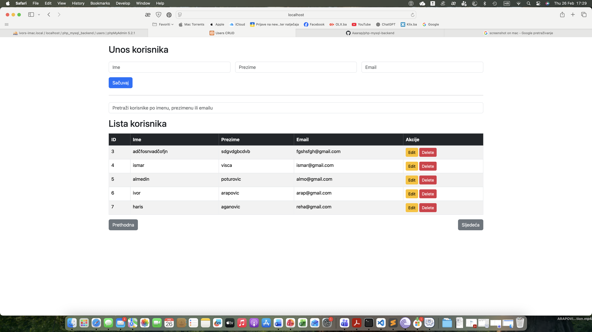

# php-mysql-backend

## 1. Podaci o studentu
**Ime i prezime:** Ivor Arapović

**Predmet:** Softver inžinjering

---

## 2. Opis projekta
Ovaj projekat predstavlja jednostavan **CRUD sistem za upravljanje korisnicima**.
Omogućava:
- Dodavanje korisnika (Ime, Prezime, Email)
- Prikaz korisnika u tabeli
- Izmjenu postojećih korisnika
- Brisanje korisnika
- Pretragu korisnika
- Paginaciju
- Validaciju forme (PHP i JavaScript)
- Responsive dizajn pomoću **Bootstrap 5**

Backend je napravljen u **PHP-u + MySQL**, frontend u **HTML5, CSS3, JavaScript + Bootstrap**.

---

## 3. Screenshot aplikacije

